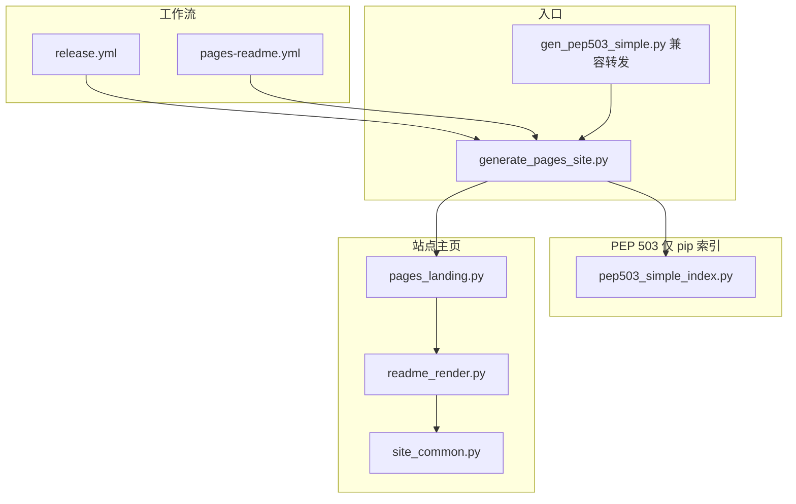

# GitHub Pages 站点生成脚本说明

本目录脚本仅在 **GitHub Actions**（或本地模拟相同环境变量）中运行，用于在 CI 检出目录下生成 **`site/`**，再由 `peaceiris/actions-gh-pages` 推送到 **`gh-pages`** 分支。

## 调用关系（谁调谁）

| 模块 | 职责 | 被谁 import / 调用 |
|------|------|-------------------|
| **`generate_pages_site.py`** | 读环境变量，编排：先写 `simple/`（发版模式），再写根 `index.html`；`PAGES_README_ONLY=1` 时只更新主页 | `release.yml`、`pages-readme.yml` 直接 `python` 执行 |
| **`gen_pep503_simple.py`** | 历史入口，转调 `generate_pages_site` | 可手工运行，与旧文档兼容 |
| **`pep503_simple_index.py`** | 生成 **PEP 503** 所需的 `simple/<项目名>/index.html`（wheel 链接列表） | 仅被 `generate_pages_site`（发版路径）调用 |
| **`pages_landing.py`** | 生成给人看的 **站点主页**（Hero、要点、安装示例 + README 正文区） | 被 `generate_pages_site` 调用 |
| **`readme_render.py`** | 解析 README 首段摘要、Markdown→HTML | 被 `pages_landing` 调用 |
| **`site_common.py`** | 如 `repo_short_name` 等小函数 | 被 `readme_render` 调用 |

## 两种运行模式

| 模式 | 环境变量 | 产物 |
|------|----------|------|
| **发版** | `GITHUB_REPOSITORY`、`RELEASE_TAG`、`WHEEL_FILENAME`、`PEP503_PROJECT`，可选 `PREVIOUS_INDEX_HTML` | `site/simple/.../index.html` + `site/index.html` |
| **仅 README** | `PAGES_README_ONLY=1`、`GITHUB_REPOSITORY`、`PEP503_PROJECT`、`DOCS_REF`（分支名） | 仅 `site/index.html`（部署时 `keep_files` 保留已有 `simple/`） |

依赖：**`pip install markdown`**（`readme_render` 使用）。

## 与仓库根 README 的关系

根目录 **`README.md`** 是主页正文的单一来源；**`pages_landing`** 只负责版式与固定区块，不重复维护长文档。
