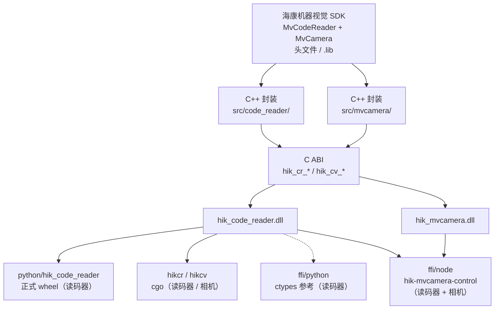

# hik-mvcamera-control

围绕海康机器人 **机器视觉 SDK** 的本地封装与工程骨架：仓库已包含 **读码器（MvCodeReader）** 与 **工业相机（MvCamera）** 两套 SDK 的头文件与导入库，`src/code_reader/` 与 `src/mvcamera/` 各是一套 C++ 封装（设备枚举、开关流、网络与参数设置等），并带有基于 GoogleTest 的 CMake 测试目标。对外提供 **稳定 C ABI**（`hik_cr_*` / `hik_cv_*`），便于 **Python（ctypes）**、**Go（cgo）** 与 **Node（N-API，统一包 `ffi/node` → `hik-mvcamera-control`）** 等语言加载 `hik_code_reader.dll` / `hik_mvcamera.dll` 共享库调用。

## 项目架构（分层与自动化）

### 运行时与代码分层

自底向上：**厂商 SDK**（`include/`、`lib/` 中海康头文件与导入库）→ **`src/code_reader/` / `src/mvcamera/`** C++ 封装（设备、参数、回调等）→ **导出 DLL** `hik_code_reader.dll`（`hik_cr_*`）/ `hik_mvcamera.dll`（`hik_cv_*`）→ 上层语言通过 **FFI** 加载 DLL：



- **构建**：根目录 **CMake** 生成静态库、测试与 **共享库**（目标名见 `CMakeLists.txt`）。  
- **Python 正式包**：`python/` 下 `build` 打 wheel，**`release.yml` 发版**仅将 **`hik_code_reader.dll`** 与海康 **`lib/MvCodeReader/win64/*.lib`** 拷入 `hik_code_reader/_native/`；**不把海康运行时 DLL 绑在「开发机是否安装 MVS」上**。终端环境通过安装 MVS/IDMVS Runtime 或你方**专用打包流水线**（自托管 Runner、私有制品等）提供 ``MvCodeReaderCtrl.dll`` 等。  
- **Go**：`hikcr` / `hikcv` 通过 cgo 链接 `runtime/` 里已构建的转发库与厂商运行时，**使用方无需安装 MVS/IDMVS**（见下文「Go 开发者」）。**转发库仍由 CMake+MSVC 编出**，cgo 编译 C 片段需 **GCC 类工具链**（如 MinGW 的 `gcc`），勿将 `CC` 设为 `cl`（见 `go.dev/issue/20982`）。

### GitHub Actions 在流程中的位置

| 环节 | Workflow | 作用（简述） |
|------|----------|-------------|
| 发版 | **`release.yml`** | 打 tag `v*` → 同步 `pyproject` 版本、构建产物、GitHub Release、**`gh-pages`**（含 PEP 503 + 主页）、`ffi/go/v*` 标签。 |
| 文档页增量 | **`pages-readme.yml`** | 仅 **`main`/`master`** 上 **README** 或 **`.github/scripts/`** 变更时，重生成 **主页** `index.html`，保留已有 **`simple/`**。 |

**站点生成脚本**的模块关系、环境变量与两种模式说明见 **`.github/scripts/README.md`**（与根 README 互补：根文档讲「产品」，该文件讲「Pages 构建脚本怎么拼在一起」）。

## 功能概览（读码器 C++ 封装）

- **枚举设备**：`enumDevice()`，返回序列号、GigE 导出 IP 与**设备型号**（`modelName`，如 `MV-IDB005EX`=读码器、`MV-CU013`=相机）等信息（见 `src/code_reader/device_info.cpp`）。> 注意：海康 GigE 枚举会把同网段**读码器与工业相机**一并列出，靠型号区分。
- **运行控制**：`startDevice` / `stopDevice`（内部完成打开设备、可选 `CodeReaderOpenParams`、BCR 回调与起停流等；按序列号操作）。
- **读码回调**：通过 `startDevice` 第三参传入；`std::nullopt` 保留已有登记，空 `std::function` 可取消该序列号回调。**软触发**：`triggerDevice`（仅当设备处于取流 Grabbing）。
- **改参 / GenICam**：`startDevice` 第二参 `CodeReaderOpenParams` 含默认值，起流前写入；按需覆盖各成员即可。另提供与相机同构的参数读写 `setReaderParam` / `getReaderParam` / `runReaderCommand`（C ABI：`hik_cr_set_param` / `hik_cr_get_param` / `hik_cr_set_param_string` / `hik_cr_get_param_string`），可按 GenICam 节点名读写 Int/Float/Bool/Enum/String 并执行命令节点（如 `TriggerSoftware`）。
- **GigE 枚举**：`enumDevice` / `hik_cr_enum_devices` 仍返回当前 **导出 IP**（`netExportIp`）等摘要，便于展示与日志；本库不再提供改 IP 的封装。
- **BCR 回调指针生命周期**：`hik_cr_start_device` 的 BCR 回调传出的 `codes` 指针指向 SDK 保留到「下次解码」的结果，**在回调返回后仍短暂有效**，供把回调排队的 FFI（koffi→JS 主线程、ctypes 异步等）延迟消费；同步消费（cgo）行为不变。
- **C API / FFI**：C 函数前缀 `hik_cr_*`，返回 `HikCrResult`，错误信息用 `hik_cr_last_error_copy` 按线程读取。正式发布用 **`python/hik_code_reader`**（wheel 内嵌 DLL）；`ffi/python` 为同逻辑参考副本。Go 见 **`hikcr/`**（读码器）与 **`hikcv/`**（相机）。

## 在 GitHub 上托管分发（维护者）

GitHub Packages **没有**与 PyPI 对等的 Python 包仓，也**没有**替代 `go get` 的独立 Go Registry。本仓库采用 **「Releases + GitHub Pages（PEP 503）+ Git 标签」**，全部留在 GitHub 上完成托管。

### 原理简述

| 对象 | 托管位置 | 作用 |
|------|----------|------|
| Python wheel | **GitHub Releases** 附件 | 真实安装包；`pip` 最终下载的文件 |
| `pip search` 式索引 | **GitHub Pages**（`gh-pages` 分支的 `simple/`） | 符合 **PEP 503**，让开发者能用 `pip install 包名==版本 --index-url ...` |
| Go 源码模块 | **本仓库 Git** + 标签 **`vX.Y.Z`**（模块根即仓库根） | `go get` 经官方模块代理从 GitHub 拉取 |

### 维护者一次性配置

1. 保证仓库根 **`go.mod`** 第一行与 GitHub 仓库路径一致。本仓库应为：  
   `module github.com/snippet0809/hik-mvcamera-control`  
   （若 fork 后自用，请改为 `github.com/<你的用户名>/hik-mvcamera-control`。）  
   模块根即仓库根，所以 **`vX.Y.Z` 标签本身就是模块版本**，不再需要单独的 `ffi/go/v*` 标签。
2. 在 GitHub 打开本仓库：**Settings → Pages**  
   - **Build and deployment**：Source 选 **Deploy from a branch**  
   - Branch 选 **`gh-pages`**，文件夹选 **`/(root)`**  
   - 保存。首次需等 **`release.yml` 成功跑过一次** 后才有 `gh-pages` 分支。

### 维护者发版步骤

1. 在默认分支上确认代码与 `python/pyproject.toml` 已就绪。  
2. 创建并推送 **语义化标签**（必须以 `v` 开头）：  
   `git tag v0.0.2 && git push origin v0.0.2`  
3. **GitHub Actions** 中 **`Release`** 工作流（`release.yml`）会自动：  
   - 将 **`python/pyproject.toml` 里的 `version`** 改成与标签一致（去掉 `v`，如 `v0.0.2` → `0.0.2`），再构建 **Windows x64 wheel**（`_native/` 内含 `hik_code_reader.dll` 与海康 `MvCodeReaderCtrl.lib` / `turbojpeg.lib`）；  
   - 创建/更新 **GitHub Release**，并上传 wheel、Go/cgo 用 zip（含 `lib/MvCodeReader/win64`）、`hik_code_reader.dll`、`hik_code_reader.lib` 及上述厂商 `.lib`；  
   - 生成 **PEP 503** 页面并推送到 **`gh-pages`**（与已有索引合并，保留历史版本链接）；  
   - 在同一提交上自动创建 **`ffi/go/v0.0.2`** 标签（若不存在），供 `go get` 使用。

### 发版后维护者自检

- **Releases** 页面是否出现新版本，且附件中有 `.whl`。  
- **Actions** 里 `Release` 是否全部绿色。  
- **Settings → Pages** 是否显示站点地址（约 `https://<用户>.github.io/<仓库名>/`）。  
- 浏览器打开 `https://<用户>.github.io/<仓库名>/simple/hik-code-reader/`，应能看到指向 Release 的链接。

---

## 开发者使用指南

以下示例以本仓库 `github.com/snippet0809/hik-mvcamera-control` 为准；若你 fork 或改名，请替换路径中的用户名与仓库名。

### Python 开发者

**环境**：当前 wheel 为 **Windows x64**（文件名中含 **`win_amd64`**），需在对应环境安装。

**方式 A：从 GitHub Release 直链安装 wheel（不依赖 Pages，最省事）**  

1. 打开本仓库 **[Releases](https://github.com/snippet0809/hik-mvcamera-control/releases)**，选择对应版本（如 **`v0.0.2`**）。  
2. 在 **Assets** 里找到 **`hik_code_reader-…-py3-none-win_amd64.whl`**，复制其「直链」；或直接使用与 tag、版本一致的 URL（**tag 带 `v`，包版本号无 `v`**）：

```bash
pip install "https://github.com/snippet0809/hik-mvcamera-control/releases/download/v0.0.2/hik_code_reader-0.0.2-py3-none-win_amd64.whl"
```

其它版本请把 URL 中的 **`v0.0.2`** / **`0.0.2`** 换成你的 tag 与 `pyproject` 版本；**wheel 完整文件名以该 Release 页 Assets 为准**。

**方式 B：像「私有 PyPI 源」一样用 PEP 503（依赖 Pages）**  
在维护者已开启 **GitHub Pages**（`gh-pages`）且发过版的前提下：

```bash
pip install "hik-code-reader==0.0.2" \
  --index-url "https://snippet0809.github.io/hik-mvcamera-control/simple/" \
  --trusted-host "snippet0809.github.io"
```

- 版本号 **`0.0.2`** 与 Git 标签 **`v0.0.2`** 对应（无 `v`）。  
- `--trusted-host` 在部分企业网络下必填；若 pip 仍报错，请检查 HTTPS 与防火墙。  
- 首次如何开 Pages、索引如何生成，见上文 **「在 GitHub 上托管分发」** 与 **README** 中维护者章节。

**代码示例**：

```python
from hik_code_reader import HikCodeReader

cr = HikCodeReader()  # wheel 内有 hik_code_reader.dll；MvCodeReaderCtrl 等 DLL 由本机 Runtime 或你方部署方式提供
print(cr.enum_devices())
```

**pip 安装后提示找不到 DLL / WinError 126 / 0xc0000135**  

- **公共 wheel** 不含海康运行时 ``*.dll``（打包流程不假设维护者电脑装了 MVS）。请在 **运行工控机** 上安装 **MVS/IDMVS RunTime**（或与 SDK 版本匹配的官方运行库），使 **`Path`** / **`GENICAM_GENTL64_PATH`** / **`MVCAM_GENICAM_CLPROTOCOL`** 等到位。  
- 若你要 **免安装分发**：在你方**固定版本、可复现**的打包环境（例如已装对应 MVS 的 **自托管 Runner**、或从**私有制品库**取与 SDK 锁定的 DLL 集）里组装配应用，**不要**依赖「开发 SDK 的那台 PC」是否装了 Runtime。  
- **Python（Windows）**在 `ctypes` 加载前：将 **`hik_code_reader.dll` 所在目录**置于 **`PATH` 与 `add_dll_directory` 优先**，再补充上述海康变量与 **`Path`** 中含 **`MVS` / `IDMVS` / `MvSDK` / `MvCode`** 的目录；并使用 **`LoadLibraryEx`** 标志，便于把 **`MvCodeReaderCtrl.dll`** 等与 `hik_code_reader.dll` **放在同一目录**时能被解析。  
- 若仍失败：用依赖查看工具打开 **`hik_code_reader.dll`** 核对缺失的 `.dll`；并确认 **VC++ x64 运行库**已安装。

### Go 开发者

**模块路径**（`go.mod` 在仓库根）：

```text
github.com/snippet0809/hik-mvcamera-control
```

**安装**：

```bash
go get github.com/snippet0809/hik-mvcamera-control@v0.2.0
```

**代码中导入**：

```go
import (
    "github.com/snippet0809/hik-mvcamera-control/hikcr" // 读码器
    "github.com/snippet0809/hik-mvcamera-control/hikcv" // 相机
)
```

> **破坏性变更**：早先的模块路径是 `.../hik-mvcamera-control/ffi/go`，包在 `.../ffi/go/hikcr`。
> 现已抬到仓库根，导入路径变成 `.../hikcr` 与 `.../hikcv`，已有的 `import` 与 `require` 都要改。
> 那次搬迁同时修好了两个让 `go get` 根本编不过的问题——旧的 cgo 头路径落在模块根之外
> （模块 zip 拿不到 `include/`），且参数读写直接写了 `cv.type`（`type` 是 Go 保留字）
> 与匿名 union 成员。**旧路径任何时候都没有真正可用过。**

**链接模型——无需安装 MVS/IDMVS**：头文件与库都来自仓库内提交的 `runtime/`
（来源与哈希见 `runtime/VERSION`、`runtime/MANIFEST.sha256`），cgo 参数直接指向它：

```go
#cgo CFLAGS: -I${SRCDIR}/../runtime/include
#cgo windows LDFLAGS: -L${SRCDIR}/../runtime/windows-x86_64/lib -lhik_code_reader
#cgo linux   LDFLAGS: ... -Wl,-rpath,$$ORIGIN/runtime/linux-x86_64/lib -Wl,--disable-new-dtags
```

**部署时的唯一要求：把 `runtime/<平台>/` 里的转发库与厂商库，统统放到可执行文件旁边。**

- **Windows**：`runtime/windows-x86_64/bin/` 的**全部内容**拷到 exe 同目录。cgo 会把
  `hik_code_reader.dll` / `hik_mvcamera.dll` 写进 exe 的 PE 导入表，ntdll 在任何 Go 代码
  运行之前就解析它们，所以**只能靠同目录**（`AddDllDirectory` / `PATH` 对这一步来不及，
  它们只对 SDK 后续自己迟加载的那一层有用）。
- **Linux**：`runtime/linux-x86_64/lib/` 与可执行文件保持 `$ORIGIN` 相对位置即可。
  万一你把二进制挪到了别处，兜底是 `LD_LIBRARY_PATH=<...>/linux-x86_64/lib`。

**平台与工具链**：

- 仅支持 **windows/amd64** 与 **linux/amd64**（`runtime/` 里的厂商二进制只有这两个）。
  其余平台会命中空包 stub，`go build` 不会失败，但调用点会报 `undefined`。
- 需要 `CGO_ENABLED=1` 与 gcc/clang 工具链。Windows 下 **C 编译器用 MinGW `gcc` 等**，
  勿设 `CC=cl`（见 `go.dev/issue/20982`）。
- **cgo 不能交叉编译**：要在 Linux 上跑就在 Linux 上编。

**免安装验收**（`cmd/hikprobe`）——只看「能枚举到设备」说明不了问题，装了 MVS 的机器上
怎么跑都会成功。探针会额外**枚举本进程已加载的模块**，打印任何既不在 exe 目录、也不在
系统目录下的模块：

```bash
go build -o hikprobe ./cmd/hikprobe
# 把 runtime/windows-x86_64/bin/* 和 hikprobe.exe 放进同一个干净目录，然后：
#   set PATH=C:\Windows\system32;C:\Windows
#   set GENICAM_GENTL64_PATH= & set MVCAM_SDK_PATH= & set HIK_CODE_READER_DLL=
#   hikprobe.exe -net=socket
```

期望：所有海康模块都标 `ok`（落在 exe 目录），末尾打印「免安装验收通过」。
`-net` 可选 `auto` / `driver` / `socket`；`socket` 免 GigE 过滤驱动，是不装 MVS 时的选择。

**私有仓库**：`go env -w GOPRIVATE=github.com/snippet0809/*`，必要时配置 SSH 或带 token 的 HTTPS。

## GitHub Actions 摘要

| Workflow | 说明 |
|----------|------|
| **Release**（`.github/workflows/release.yml`） | 推送 **`v*.*.*`**：**GitHub Release** 附件、**gh-pages**（更新 **pip** 用 `simple/` 与根目录 **README 页**）、自动 **`ffi/go/v*`** 标签。 |
| **Pages (README)**（`.github/workflows/pages-readme.yml`） | 推送到 `main`/`master` 且变更 **`README.md`** 或 **`.github/scripts/`** 下站点生成脚本时：只重部署 **根 `index.html`**（入口为 **`generate_pages_site.py`**），`keep_files` 保留 **`simple/`**。 |

## 仓库结构

| 路径 | 说明 |
|------|------|
| `src/code_reader/` | 读码器 C++ 封装实现（`code_reader.h`、`c_api.cpp` 等） |
| `include/hik_code_reader/` | **C ABI 头文件**（`c_api.h`），供 Python/Go 等包含 |
| `python/` | **`hik-code-reader`** 包与 `pyproject.toml`（wheel 的 `_native/` 含 DLL 与海康 win64 导入库） |
| `ffi/python/` | ctypes 参考实现（与 `python/hik_code_reader` 保持同步为佳） |
| `go.mod`（仓库根） | Go 模块根（模块路径即仓库路径） |
| `hikcr/`、`hikcv/` | Go 包：读码器、相机（cgo，链接 `runtime/`） |
| `runtime/` | **随仓库提交的海康运行时**（来源与哈希见 `runtime/VERSION`、`runtime/MANIFEST.sha256`）；`include/` 是 C ABI 头，`<平台>/` 是转发库与厂商库 |
| `internal/hikdll/` | Windows 下登记厂商 DLL 搜索目录（`hikcr`/`hikcv` 共用） |
| `cmd/hikprobe/` | 免安装验收探针（含已加载模块审计） |
| `scripts/verify-runtime.sh` | 校验 `runtime/`：哈希 + ABI 三重守卫 |
| `ffi/node/` | **统一 npm 包 `hik-mvcamera-control`**（node-addon-api）：单插件同时导出读码器（`HikCodeReader`）与相机（`HikCamera`）；预编译 `.node` + 读码器/相机运行时全捆绑 |
| `include/MvCamera/`、`include/MvCodeReader/` | 海康 SDK 头文件 |
| `lib/MvCamera/{win32,win64}/`、`lib/MvCodeReader/{win32,win64}/` | 预置静态库（含 `turbojpeg` 等读码器依赖） |
| `tests/` | GTest 用例（需连接真实设备时谨慎运行） |
| `.docs/` | 本地文档（如读码器开发指南 CHM） |

## 构建要求

- **CMake** 4.0 及以上（见根目录 `CMakeLists.txt`）。
- 支持 C++17 的 **MSVC**（当前工程通过 `FetchContent` 拉取 **GoogleTest**）。
- **Windows**：默认链接 `lib/MvCodeReader/win64/MvCodeReaderCtrl.lib`；若在 32 位环境构建，需自行将 CMake 中的库路径改为 `win32` 对应文件。

### 工具链怎么选：wrapper 用 MSVC，cgo 用 MinGW

**构建 `hik_code_reader.dll` / `hik_mvcamera.dll` 请用 MSVC。**

gcc(MinGW) 也能编——GNU ld 直接读海康那两个 MSVC 导入库没问题，导出符号与 MSVC 逐字节一致
（13/13 未修饰同名）。但**默认配置下它会静默产生错误数据**：海康 `PixelType.h` 用
`#ifdef WIN32` 在两种定义间切换，而 MinGW 只定义 `_WIN32`、不定义 `WIN32`，于是
`MvGvspPixelType` 从 4 字节变 8 字节，`MV_FRAME_OUT_INFO_EX` 之后所有字段整体错位——
`width`/`height` 恰好还对（它们在结构体开头），但 `frameLen` 读成 0、`frameNum` 是垃圾值。

要修得加两个定义（CMake 的 `if(MINGW)` 分支已代劳）：`WIN32`（让枚举回到 4 字节），
以及 `-D__int64="long long"`（`WIN32` 分支里写的是 MSVC 专有的 `typedef __int64 int64_t;`，
MinGW 的 gcc 不认）。另需去掉产物名的 `lib` 前缀、并把 GCC 运行库静态并入。

即便修好，这个位置仍是脆的：它依赖厂商头的 ifdef 写法，海康更新 SDK 可能重新错位。
`tests/mvcamera_test.cpp` 里有逐帧元数据断言专门守这一点（校验 `frameLen` 与 `宽x高` 自洽），
但**选与厂商相同的工具链仍然更省心**——wrapper 很少重新编译，MSVC 构建慢一点也不重要。

**cgo 则必须用 MinGW**：Go 在 Windows 上的 cgo 不能用 `cl`（见 `go.dev/issue/20982`），
所以 Go 使用者无论如何都要装 gcc 类工具链。两个工具链并存是正常状态，不是妥协。

## 构建与测试

```powershell
# MSVC（推荐）。生成器名跟本机 VS 版本走，用 cmake --help 查：
#   VS 2026 -> "Visual Studio 18 2026"；VS 2022 -> "Visual Studio 17 2022"
cmake -S . -B build-vs -G "Visual Studio 18 2026" -A x64
cmake --build build-vs --config Release
ctest --test-dir build-vs -C Release
```

```powershell
# MinGW（可用，但请先读上文的限制）
cmake -S . -B build-mingw -G Ninja -DCMAKE_BUILD_TYPE=Release `
      -DCMAKE_C_COMPILER=D:/mingw64/bin/gcc.exe -DCMAKE_CXX_COMPILER=D:/mingw64/bin/g++.exe
cmake --build build-mingw
```

**用 MSVC 但想走 Ninja**（需已安装 Ninja 且在同一 shell 中加载 MSVC 环境）：

```powershell
cmake -S . -B build-ninja -G Ninja -DCMAKE_BUILD_TYPE=Release
cmake --build build-ninja
```

首次配置会从网络下载 GTest；需保证构建环境可访问 GitHub。

产物说明：

- **`hik_code_reader_static.lib` / `hik_mvcamera_static.lib`**：静态库，供 `all_tests` 等链接。
- **`hik_code_reader.dll`**（目标 `hik_code_reader_shared`，导出 `hik_cr_*`）与 **`hik_mvcamera.dll`**（目标 `hik_mvcamera_shared`，导出 `hik_cv_*`）：共享库供 FFI。Python 可将环境变量 **`HIK_CODE_READER_DLL`** 设为读码器 DLL 的完整路径，或把 DLL 放到进程当前目录 / `PATH`；Node 统一包 `ffi/node`（`hik-mvcamera-control`）直接捆绑两个 DLL 与海康读码器/相机运行时。
- **发版产物**：见上文 **Release / gh-pages**。

## 运行与部署说明

1. 在目标机器安装海康读码器/视觉设备所需 **驱动与运行库**（版本需与 SDK 匹配）。
2. GigE 设备注意网卡、防火墙与网段；改 IP 请使用海康官方工具/SDK，本仓库封装不再提供 `setIp`。
3. 将 SDK 提供的 **DLL**（若静态链仍依赖运行时）放在可执行文件同目录或系统 `PATH` 中，按官方文档为准。

### 读码器 SDK 使用要点（与 `.docs` 开发指南 CHM 一致）

以下摘要自海康读码器 **SDK 开发指南**，使用本封装或直连 `MvCodeReader` 前请一并遵守：

1. **GigE 网口巨帧**：使用前需先在网卡上开启 **巨帧（Jumbo Frame）**，否则大包/高负载下易丢包或异常。  
2. **RunTime 包**：需安装与目标程序 **位数一致**（32 位 / 64 位）的 **工业相机 SDK RunTime**，且版本为 **RunTime 3.0.0 及以上**。  
3. **回调与轮询互斥**：**回调类接口**与 **轮询类接口**不能同时用来取图；二者二选一，不可混用。  
4. **多路回调**：对指定流通道调用底层 **`MV_CODEREADER_MSC_RegisterImageCallBack()`** 可注册回调；可对多路流通道分别注册，以同时获取多路图像与条码结果。  
5. **多路轮询**：**`MV_CODEREADER_MSC_GetOneFrameTimeout()`** 可按通道轮询取图；可对多路流通道分别轮询，以同时获取多路数据。

本仓库 C++ 封装在取流路径上主要采用 **回调** 模式（如 BCR 回调）；若你在同进程内再调官方 **轮询** 接口，须遵守上述互斥约定。更细的参数与流程以 **CHM / 官方 PDF** 为准。

### Windows：RunTime 位置与「环境变量」说明

海康 **MVS / IDMVS / RunTime** 安装器一般会同时：

- 写入 **`PATH`**（RunTime、`IDMVS\...\MvSDK` 等）；  
- 写入 **GenICam / MVS 相关变量**（示例，以你机为准）：**`GENICAM_GENTL64_PATH`**、**`GENICAM_GENTL32_PATH`**、**`MVCAM_GENICAM_CLPROTOCOL`** 等。

**`python/hik_code_reader`** 在 Windows 上会读取上述 **路径型官方变量** 及 **`Path`** 中的 MVS/IDMVS 相关目录，用于 `os.add_dll_directory`（见包内实现）。仍仅保留本仓库自有的 **`HIK_CODE_READER_DLL`**（仅指向 **`hik_code_reader.dll`** 本身，可选）。

**自查 PATH 里与厂商相关的项**（PowerShell，合并用户级与机器级）：

```powershell
('Machine','User') | ForEach-Object {
  [Environment]::GetEnvironmentVariable('Path', $_) -split ';' |
    Where-Object { $_ -match '(?i)MVS|MvCode|IDMVS|Hik|HIKROBOT|Runtime|Common Files\\MVS' }
} | Sort-Object -Unique
```

**自查海康常见路径型环境变量**（当前进程继承的安装器配置）：

```powershell
'GENICAM_GENTL64_PATH','GENICAM_GENTL32_PATH','MVCAM_GENICAM_CLPROTOCOL' | ForEach-Object {
  "${_}=$([Environment]::GetEnvironmentVariable($_,'Process'))"
}
```

常见会出现的路径形态（**仅供参考，以你机器上安装版本为准**）：

- 含 **`Common Files\MVS\Runtime`** 或 **`Runtime\Win64`** 等字样的目录（独立 RunTime 包或套件附带）。  
- 含 **`MVS`**、**`Development`**、**`Bin\win64`**（完整开发包）或 **读码器 / IDMVS** 安装目录下的 **`Bin`**。

若进程仍报 **找不到 DLL / 0xc0000135**：除检查 `PATH` 外，还可把缺失的 DLL 放到 **`hik_code_reader.dll` 同目录**，或确认与 **RunTime 3.0.0+** 及 **x64/x86 位数** 一致。

## 许可证与第三方

海康威视 **MvCamera / MvCodeReader** SDK 及其文档的版权与许可归原著作权人所有；本仓库中的封装代码请以你方项目许可证为准。GoogleTest 遵循其开源协议（由 CMake `FetchContent` 获取）。

## 相关文档

- 读码器开发说明可参考仓库内 **`.docs`** 下 **CHM（读码器 SDK 开发指南）** 及 **`include/MvCodeReader`** 头文件中的 API 定义（如 `MV_CODEREADER_MSC_*`）。
